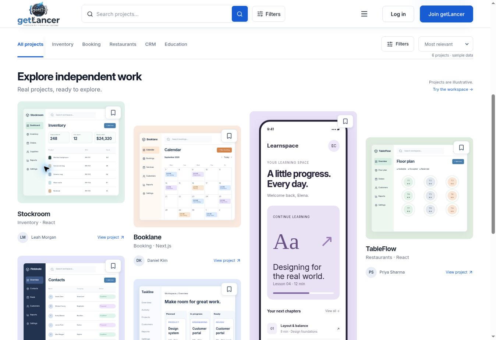

# Mixed-format gallery review

Reference inspected: https://godly.design/ on 2026-09-28. Observed equal-width masonry columns with variable-height portrait and landscape media. Applied only the demo-gallery pattern; brand, navigation, hero and search remain unchanged.

- TypeScript check: passed.
- Production build: passed.
- Frontend regression tests: 27 passed, 0 failed.
- Desktop browser: six project cards, four columns, portrait Learnspace demo taller than landscape projects, no horizontal overflow.
- Source screenshots use natural height and contain rather than cropped fixed-height covers.
- ResizeObserver recalculates shortest-column positions when card/image dimensions change. Desktop columns begin at 0/64/24/96px offsets; browser review confirms distinct top positions, a tall mobile card in the first group, and no horizontal overflow. No-JavaScript fallback uses CSS columns.
- Responsive CSS: two columns at <=1000px and one at <=640px; mobile interaction not separately tested.
- Sample mobile screen is illustrative, not a live product or a copied Godly asset.

